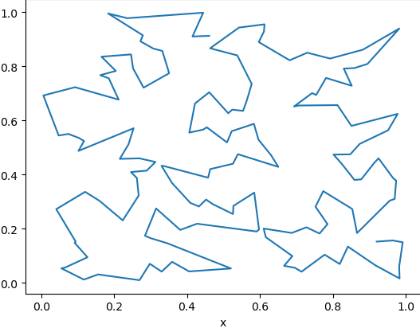

# Pytoch-based TSP Solver with Fast CMA-ES

Welcome to the PyTorch implementation of the Fast Covariance Matrix Adaptation Evolution Strategy (CMA-ES) based Travelling Salesman Problem (TSP) solver on GPU! This repository contains the open-source implementation for a TSP solver that utilizes the Fast CMA-ES algorithm, developed using the PyTorch framework and designed to run on a GPU for improved performance. The implemented solver can find approximate solutions to real-world TSP instances, with the ability to handle a range of problem sizes.

TSP is a well-known problem in computer science, in which a salesman must visit a set of cities, traveling from city to city and returning to the starting city in the end, in the shortest possible route. CMA-ES algorithm is a popular heuristic optimization method used to find approximate solutions to difficult optimization problems, such as the TSP. This implementation takes advantage of GPU acceleration provided by the PyTorch framework to significantly improve the performance of the CMA-ES algorithm.

